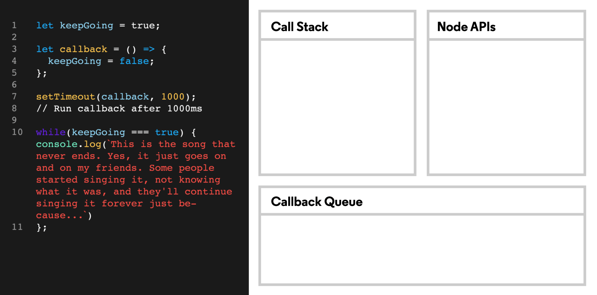

link to lesson:

https://www.codecademy.com/paths/create-a-back-end-app-with-javascript/tracks/bapi-learn-express/modules/introduction-to-node-js/lessons/node/exercises/event-loop


### Learn Node.js

**Asynchronous JavaScript with Node.js**

In server-side development, we often perform time-consuming tasks such as reading files or querying a database. Instead of halting the execution of our code to await these operations or using multiple threads like other back end environments, Node was designed to use an event loop like the one used in browser-based JavaScript execution. The event-loop enables asynchronous actions to be handled in a non-blocking way.

Node provides a number of APIs for performing asynchronous tasks which expect callback functions to be passed in as arguments. Under the hood, these APIs trigger the subscription to and emitting of events to signal the completion of the operation. When the operation completes, the callback function is added to a queue, or line, of tasks waiting for their turn to be executed. When the current stack, or list, or synchronous tasks finish executing, the operations on the queue will be performed.

This means if synchronous tasks never end, operations waiting in the event-queue would never have the chance to run. Take a look at the following example code using the asynchronous Node setTimeout() API which asynchronously executes a provided callback function after a given delay:
```
let keepGoing = true;

let callback = () => {
  keepGoing = false;
};

setTimeout(callback, 1000); // Run callback after 1000ms

while(keepGoing === true) {
  console.log(`This is the song that never ends. Yes, it just goes on and on my friends. Some people started singing it, not knowing what it was, and they'll continue singing it forever just because...`)
};
```
This while-loop will continue forever! Even though the callback changing the keepGoing variable to false is added to the event queue after 1 second, it will never have a chance to run— the synchronous code from the loop will always fill the stack! If we wanted to avoid the infinite loop, we could replace the while-loop with an asynchronous function— for example, the Node setInterval() API.

Note: The modern way of handling asynchronous tasks is through JavaScript Promises (developers also favor the newer async...await syntax). If you’re not familiar with these topics, check out our lessons on them. Newer versions of Node (v8.0.0 and later) provide a collection of the traditional Node asynchronous APIs formatted for promises instead of callbacks. This can be found on util.promisify. Many contemporary 3rd party libraries also favor promise-based patterns over traditional callbacks.



